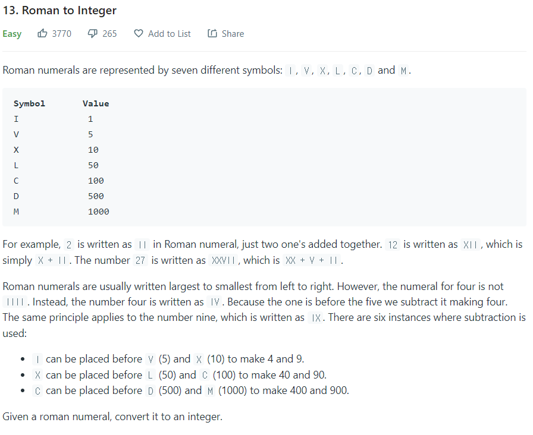

# Roman to Integer (Easy)

새로운 마음으로 다시 시작해보는 코딩테스트 준비!

&#x20;난도가 Easy라서 선택했지만 오랜만에 문제를 푸는 나에겐 easy하지 않았다...

&#x20;    &#x20;



이러한 문제인데,

'안풀리면 오래 붙잡고 있지 말라'고 한 친구의 조언대로 다른 분들의 답변을 참고했고,

가장 마음에 들었던 풀이는 다음과 같다.

문제에 힌트가 다 있었는데 놓친게 아쉽다...

```
/**
 * @param {string} s
 * @return {number}
 */
var romanToInt = function(s) {
    let result = 0;
    let values = {
        "I" : 1,
        "V" : 5,
        "X" : 10,
        "L" : 50,
        "C" : 100,
        "D" : 500,
        "M" : 1000
    }
    
    for (let i = 0; i < s.length; i++) {
        if (values[s[i]] < values[s[i+1]]) {
            result -= values[s[i]]
        } else result += values[s[i]]
    }
    
    return result;
};
```

&#x20;! 아쉬운 점

* 문제를 더욱 꼼꼼히 읽자. 힌트는 언제나 문제에 있다.
* map, object 등을 잘 활용하자.          &#x20;
